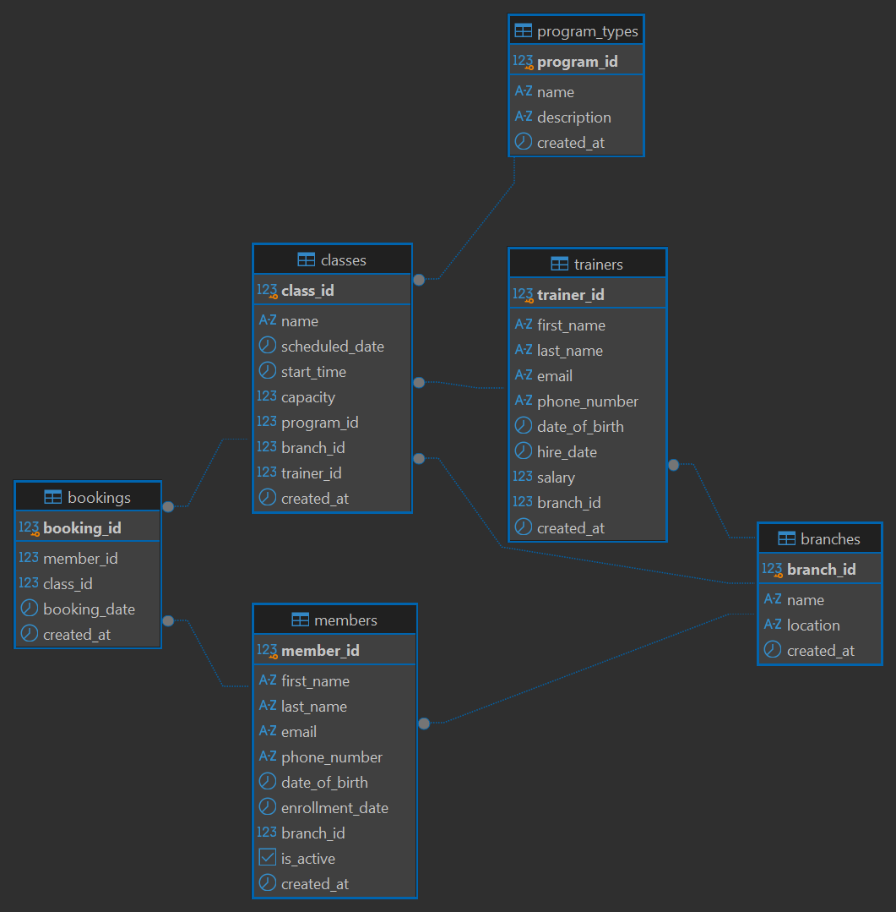

# FitCore Gym Management Database

A practice relational database project modeled on a university schema reference,
adapted to a fitness studio chain domain. Built to practice primary keys, foreign
keys, one to many relationships, and a many to many relationship resolved through
a junction table.

## Overview

FitCore is a fitness studio chain with several branches. Each branch runs its own
scheduled classes, taught by trainers based at that branch, drawn from a shared
catalog of program types. Members hold a membership and book themselves into
upcoming classes at any branch.

## Entity Relationship Diagram

## Schema

| Table | Purpose |
|---|---|
| `branches` | Physical gym locations |
| `trainers` | Staff who lead classes, each based at one branch |
| `members` | People who hold a membership and book classes |
| `program_types` | Categories of classes on offer, such as Yoga or Spin |
| `classes` | Individual scheduled sessions, each tied to a program type, branch, and trainer |
| `bookings` | Junction table linking members to the classes they've reserved a spot in |

Details of the task
[text](../../../../Downloads/FitCore_Database_Practice_Task.pdf)